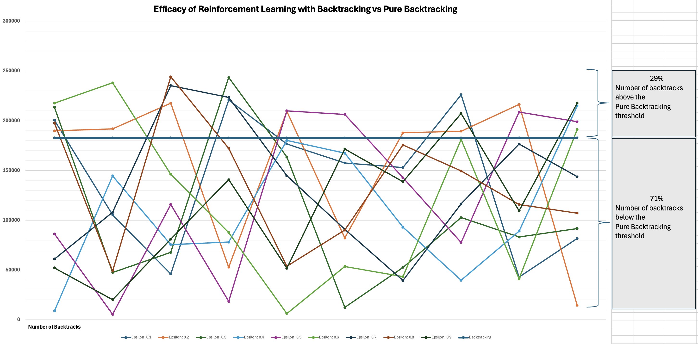
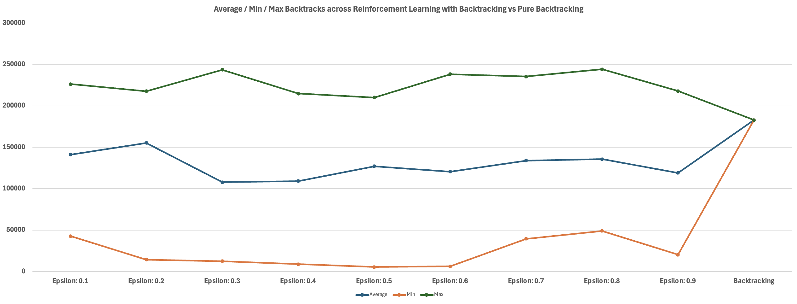

**Notes about Reinforcement Learning**

**Definition**

Reinforcement Learning is a type of machine learning where an agent learns to make decisions by taking actions in an environment and receiving rewards or penalties, gradually improving its choices through trial and error to maximize total reward

**Components**
1. Agent
2. Environment
3. State
4. Action
5. Reward

**Parameters**
1. Alpha    :  [Learning rate] Agent uses this factor to make adjustments in Q-Table
2. Gamma    :  [Reward Fulfillment] How much the agent cares about short term reward or wait for a long term reward
3. Epsilon  : [Exploit vs Explore] Probability that decides if the agent should explore a new decision or stick to known safe decision
4. Q-Table  : [State Table] The table which maps different states, actions, rewards, etc. It guides the agent to maximize reward on the current decision in such a way that the reward is maximized on the next decision. Greedy Approach.

**Use Cases**
1. Robot: Navigating Maze
2. Healthcare: Patient responses to new medications
3. NN: Searching for new activation functions
4. Sudoku: Solving Constraint Satisfaction problems

**Sudoku**
This repo provides details on solving Sudoku problems using RL. Sudoku Extreme samples are taken from https://huggingface.co/datasets/sapientinc/sudoku-extreme/resolve/main/train.csv?download=true

I tried different strategies to completely solve Sudoku puzzle, but none of them were able to solve 100%

Strategy #1: Decay epsilon over time
We tend to explore more initially and stick to known patterns with more experience. With this intuition, I tried different decay patterns
1. linear
2. wrt episodes left
3. something with curve
What worked best was the linear decay improving by 5% to 10%

Strategy #2: During exploration instead of randomly picking one of the options, pick the one based on more cell density
When we play Sudoku, we tend to start filling from the cells where its denser.
This instantly boosted the accuracy by 3% to 5%

Strategy #3: When training the NN, use swish instead of relu
This improved inference by 3% to 5%

Strategy #4: Incorporate backtracking into RL on hitting a dead-end, rolling back state, Q-table, reward, etc
This should have provided the ability to solve Sudoku, but the puzzle remained unsolved

Strategy #5: Ditch RL and use backtracking to solve Sudoku
Although the puzzle was solved every single time and data was used to train CNN.
The CNN inference was completely wrong.

Strategy #6: Combine RL with backtracking to solve Sudoku
Backtracking is amazing, it solves Sudoku puzzle every single time. It does this because it's able to iterate every possible combination of ( row, col, num ) triplet to find the solution. The cost paid with pure backtracking solution is ofcource the number of backtracks. The next question then becomes how do you decrease the number of backtracks to converge to the solution faster. This is where Reinforcement Learning shines!

To better understand RL with backtracking quantitatively, I took a puzzle and captured number of backtracks vs various Epsilon values.

Epsilon values ranged from 0.1 to 0.9
Y-axis shows the number of backtracks (lower the better) taken over 10 samples

See the average/min/max number of backtracks with and without RL

